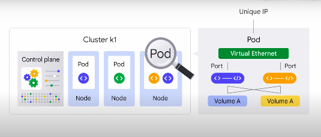
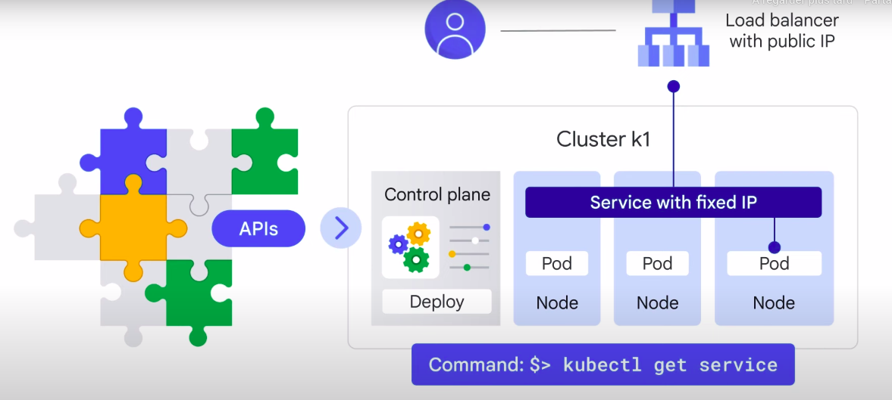
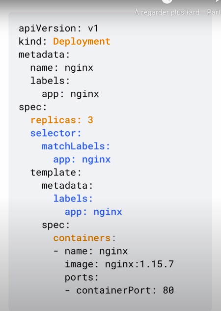
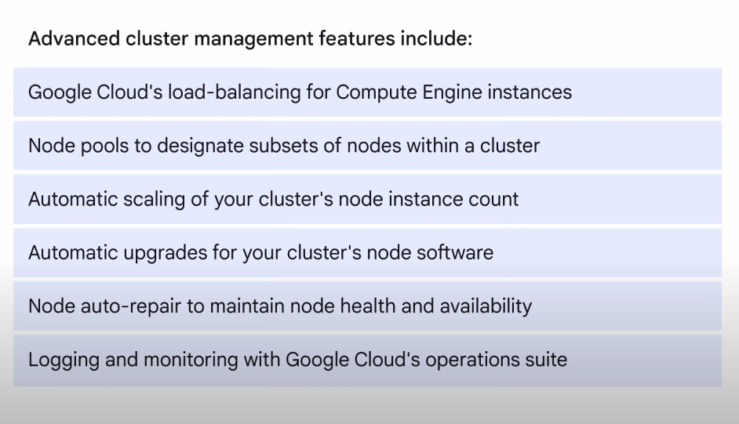

# Kubernetes
## What is Kubernetes ?
-  an open-source platform for managing containerized workloads and services
- makes it easy to orchestrate many containers on many hosts, scale them as microservices, and easily deploy rollouts and rollbacks
- a set of APIs that you can use to deploy containers on a set of nodes called a cluster
-  divided into a set of primary components that run as the control plane and a set of nodes (represents a computing instance, like a machine) that run containers
- you can describe a set of applications and how they should interact with each other, and Kubernetes determines how to make that happen

## Pod in Kubernetes
Deploying containers on nodes by using a wrapper around one or more containers is what defines a Pod.

### What is a Pod ? 
- The smallest unit in Kubernetes that you can create or deploy
- It represents a running process on your cluster as either: 
    - a component of your application
    - an entire app 
- Generally, you only have `one container per Pod`, but if you have multiple containers with a hard dependency, you can package them into a `single Pod` and share networking and storage resources between them.

    

- Provides a unique network IP and set of ports for your containers and configurable options that govern how your containers should run.
- **How to run a Pod? :**  use the `kubectl run` command, which starts a Deployment with a container running inside a Pod.
- **How to see a list of a running Pods? :** : `kubectl get pods`
- Kubernetes creates a Service with a fixed IP address for your Pods. In GKE, the load balancer is created as a network load balancer. Any client that reaches that IP address will be routed to a Pod behind the Service.
    

- **What is a Service? :** A Service is an abstraction which defines a logical set of Pods and a policy by which to access them. 
    - Command : `kubectl get service`

- **How to scale a deployment? :** `kubectl scale`
    - you can use autoscale or scale on your own

### How to use Kubernetes ?
- Instead of issuing commands, you provide a `configuration file `that tells Kubernetes what you want your desired state to look like, and Kubernetes determines how to do it.

**Example :**

- You can check your Deployment to make sure the proper number of replicas is running by using either `kubectl get deployments `or `kubectl describe deployments`.

- `kubectl rollout` : change your deployment configuration file and then apply the change using kubectl apply

## Google Kubernetes Engine (GKE)
GKE is a  Google hosted managed Kubernetes service in the cloud. provides the mechanisms through which you interact with your cluster

### GKE Environment
Consists of multiple machines, specifically compute engine instances, grouped together to form a cluster. GKE clusters can be customized and they support different machine types, number of nodes, and network settings.

### Why do we need Kubernetes ? 
Kubernetes commands and resources are used to : 
- deploy and manage applications
- perform administration tasks
- set policies
- monitor the health of deployed workloads

### Benefits of advanced cluster management 

### How to start GKE ? 
To start up Kubernetes is on a cluster in GKE, all you do is run this command `gcloud container clusters create k1`