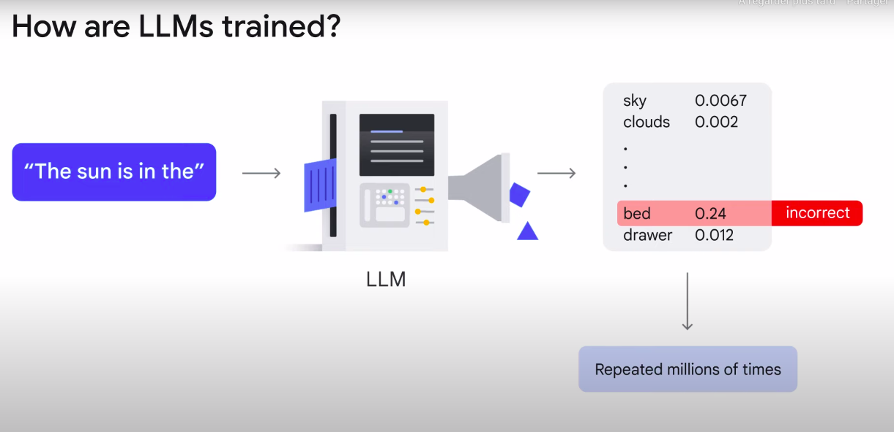

# Generative AI and Large Language Model (LLM)

While both terms describe AI models capable of generating human-like responses based on input prompts in many references, it's important to note they're not identical.

## What is generative AI?
- A subset of artificial intelligence that is capable of creating text, images, or other data using generative models, often in response to prompts.

### Gen AI models
-  capable of creating text, images, or other data using generative models, often in response to prompts (text).
- **How are they trained ?** 
    -  learn the patterns and structure from input training data and then create new data with similar characteristics 

#### Gemini (the Generative AI of Google)
#### What can Gemini do ? 
- has access to a massive range of data, including Google Cloud documentation, tutorials, and samples
- create detailed gcloud commands and insert them into Cloud Shell for her.

### LLM
- highly sophisticated computer programs trained on gigantic amounts of data that can be text or images.

#### Meaning of LLM
Large language models refer to `large`, `general-purpose` language models that can be `pre-trained` and then **fine-tuned** for specific purposes
1. **Large:**
    - The size of training dataset
    - The number of parameters. Parameters are the memories and knowledge that the machine has learned during model training. They determine the ability of a model to solve a problem, such as predicting text, and can reach billions or even trillions in size

2. **General purpose:**
    - models can sufficiently solve common problems

3. **Pre-trained:**
    - they have been pre-trained for a general purpose with a large dataset… ...and then fine-tuned for specific goals with a much smaller dataset.

#### How are LLMs trained?
- When you submit a prompt to an LLM, it calculates the probability of the correct answer from its pre-trained model. The probability is determined through a task called pre-training.
- Pre-training an LLM involves feeding a massive dataset of text, images, and code to the model so that it can learn the underlying structure and patterns of the language.

#### Hallucination 
##### What is that ? 
Hallucinations are words or phrases that are generated by the model that are often nonsensical or grammatically incorrect
##### What causes a hallucination ?
- The model is not trained on enough data
- The model is trained on noisy or dirty data.
- The model is not given enough context.
- The model is not given enough constraints.
