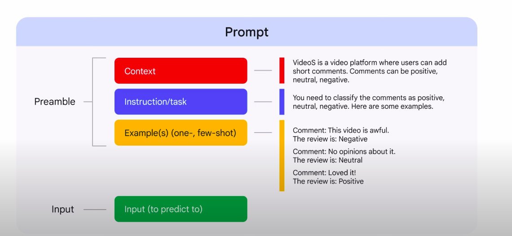

# Prompt Engineering

## What is a prompt ?
A prompt is the text that you feed to the model

## What is a prompt engineering ?
Way of articulating your prompts to get the best response from the model.

### Category of prompt 
1. **Zero-shot** : do not contain any context or examples to assist the model.
    - **Example** :  “What’s the capital of France?” does not provide any examples of what a capital is.
2. **One-shot** : provide one example to the model for context
3. **Few-shot** :  provide at least two examples to the model for context
4. **Role prompting** : require a frame of reference for the model to work from as it answers the questions
    - **Example** :I want you to act as a business professor. I’ll give you a term, and you will correctly explain its meaning.

### The two elements of a prompt

### Prompt engineering best practices
- write detailed and explicit instructions
- define boundaries for the prompt
- adopt a persona for your input (example : "You're a cloud architect, ...")
- keep each sentence concise.