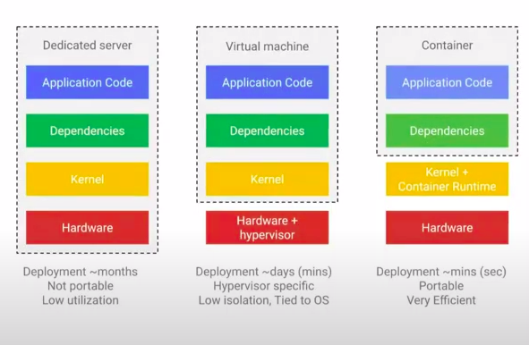
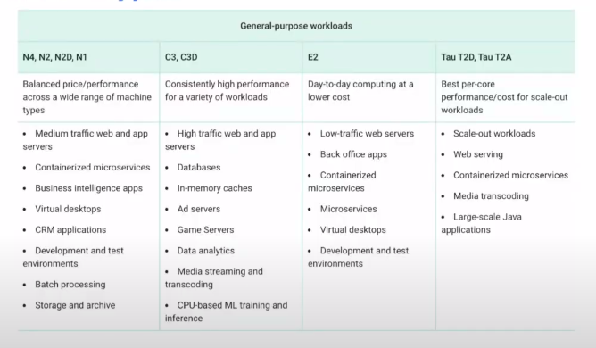
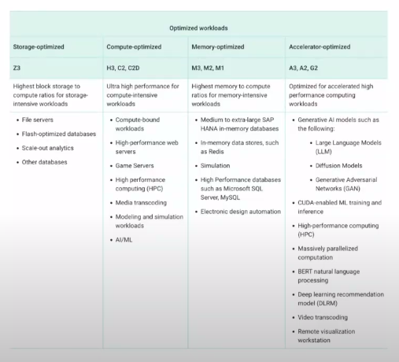
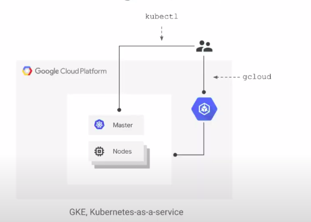
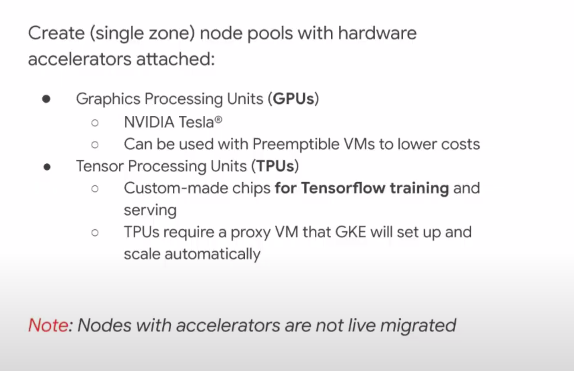
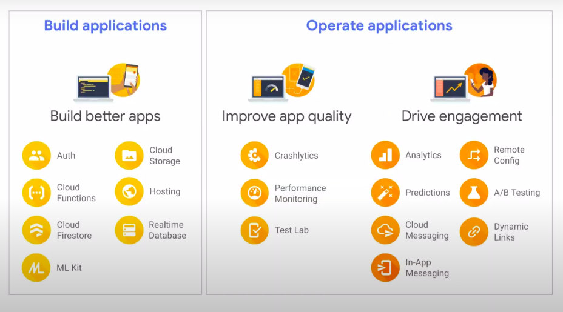

# 2- ACE Compute, GKE

## Virtual Machines

- Virtual Machines (VMs) are the most common compute resource in GCP.
- Computing infrastructure in predifined or custom machine sizes to accelerate your cloud transformation

### Difference between Dedicated Server, Virtual Machine and Container



## Compute on GCP

### 1. Compute Engine (Servers, VM instances - IaaS)

- Compute Engine is a service that provides virtual machines and networking on demand that run on Google's infrastructure.

#### Structure

- Per VM max :
    - 416 vCPUs, 12TB of RAM, GPUs, TPUs(processors dedicated to machine learning) 
    - Independently configurable, including disk
- Start quickly, 20 seconds to user code running
- Pre-built images, or create your own :
    - Debian, CentOS, CoreOS, Ubuntu, RHEL, SUSE
    - Windows Server Datacenter : 2000, 2016, ...

#### Disk

Can be : 
- Persistent Disk : 
    - Network based 
    - Configure size (to 64TB)
    - Disk or SSD 
    - Independent of VM 
        - Global snapshots
        - Multi VM RO mount
    - Larger disks === more throughput 
- Local SSD : 
    - Lowest Latency
    - Associated with the VM 
    - 375 GB per disk (up to 8)
    - Tied to VM lifecycle

#### GCE Machine Types 
1. General-purpose workload


2. Optimize workload (lower processor consumption, used for specific applications)


#### Custom Machine Feature 
Config your own custom machine, with average 19% savings : 
- Flexible configuratons
- Create a machine type with 1vCPU and up to 96 vCPUs 
- Extended Memory enables higher Mem: vCPU ratios
- Sizing recommendation 

#### Preemptible VMs 
- Short lived, low cost virtual machines 
- Can run up to 24 hours 
- Might be preempted at any time with 30 seconds notification 
- Much lower price (up to 80% cheaper) than regular instances 

#### Sole Tenant Nodes 
- **Physical servers dedicated solely for you workloads**
- All VMs belong to a single dedicated physical machine, but there is no load balancing.

#### Shielded VMs 
- VMs hardened by a set of security controls that help defend against rootkits and bootkits

#### Managed instance groups (MIGs)
A collection of identical VM instances that you control as a single entity, using an instance template. 
    - Instance group can be resized 
    - Manager ensures all instances are RUNNING 
    - Typically used with **autoscaler** 
    - Can be single zone or regional 
    - Supports autohealing (ecommission VMs with anomalies and replace them)

##### Autoscaling and health checks

- Autoscaling helps your applications gracefully handle increases in traffic and reduces cost when the need for resources is lower.

#### Substained and Committed use discounts 
See Discount Doc about GCR

### 2. Kubernetes Engine  (Clusters, Cluster Management - PaaS)
- Used with **Container**. You can start a cluster with `one-click` and view it and workloads in a single panel
- Node = server

#### Architecture


#### GKE Node Pools (same notion as server - server kit)
- A node pool is a group of nodes that have the same configuration 
- Can configure one or multiple node pools per cluster
- Users can create node pools with : 
    - Preemptible VMs 
    - GPUs or Local SSDs 
    - Custom Machine types

#### Hardware accelerators  


### Anthos (Platform on Google)
- For multi cloud capabilities are so far unique in the industry

- Features : 
    - Marketplace 
    - Service Management 
    - Managed Operations

## Serverless 
- Deploy and scale applications fast and securely in a fully managed environment (auto scaling, no infra management,...)

### 2. Cloud Run (container as Service)
- Not like Kubernetes, you just need to bring the container and it manage automatically (with kubernetes you'll need to manage node)
- Scale down to 0 if there's no consumption
- Features : 
    - Deploy in seconds 
    - Automatic HTTPS, Custom domains 
    - Any language, any library 
    - Portability 
    - Pay per use
    - Run `stateless containers` on a `fully managed environment`

#### Types of Cloud Run 
- Cloud Run fully managed
- Cloud Run on GKE

#### Build and deploy Cloud Run application 
1. **Define** : define a Dockerfile
2. **Publish** : Publish your container
```
gcloud builds submit --tag gcr.io/PROJECT_ID/helloworld
```
3. **Deploy** : Run containers on a fully managed environment
```
gcloud run --image gcr.io/PROJECT_ID/helloworld --platform managed
```

### 3. App Engine (run source based web applications on a fully managed environment)
Highly scalable, serverless web applications

#### Types of Environments on App Engine
1. **Standart environment** : 
    - Fully-managed 
    - Sandboxed processes 
    - Changes/configuration limited
    - Scale to zero
    - Specific versions of supported languages (Python, Java, Node, PHP, Ruby, Go)
2. **Flexible environment**
    - Docker container support 
    - Runs on managed VMs 
    - Any language in your computer 
    - More options for infrastructure customization end configuration for performance

### 4. Cloud Functions (Event-driven Function as a Service)
- A serverless environment to build and connect cloud services with code
- **Event emitted -> Function triggered -> Your code executed**
- Billing : You pay for what you use

#### Cloud Functions deployment 
You can deploy via 2 ways : 
- Cloud Console UI
- Command line : 
```
gcloud functions deploy myFunc \ --trigger-http
```

## Bare Metal Solution
- Dedicated physic server for your application

## Firebase 
- Google's app development platform

### Features 
- Build features 
- Operate features 
