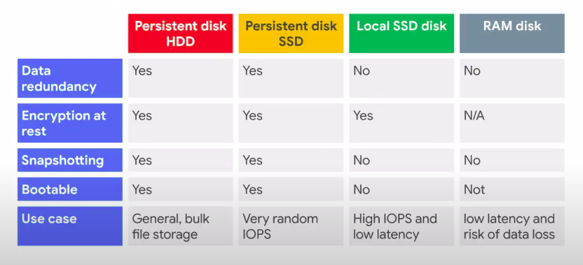
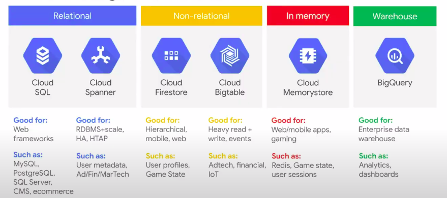

# 3-ACE Storage & Databases

## ACE Storage

### Summary of disk options

- IO (input output): measures input/output level at storage level

#### Snapshots

Use case when you need to make snapshot:

1. Back up critical data
2. Migrate data between zones
3. Transfer to SSD to improve performance

- Why do we need snapshot data ? : Back up critical data
- Snapshot service on GCP : `Cloud Storage`

## Databases

Your database choice depends on your needs :

- Application demands (Volume, security,...)
- Industry

### Why using a manage database service ?

- Cause Google manage : OS, Hypervisor, HW/Net, Datacenter
- You just need to manage : Scaling, Backups, DB software, HA (high availability)

### Types of data tier

- Relational
- Non relational
- In memory
- Datawarehouse

#### GCP Managed database services 

### Relational databases 
#### Cloud SQL 
- Fully-managed relational database service that makes it easy to set-up and administer your `MySQL, PostgreSQL & SQL Server` databases in the cloud
- Not really recommended for high availability, i.e. writing to several DBs can be distorted (split brain). As a solution, Google uses basic replication for continuous monitoring.
- When we talk about real replica, regional and cloud server it means Cloud SQL

#### Relational databases - Oracle on Baremetal
Oracle is installed on dedicated physical server

#### Cloud Spanner 
- Relational semantics (Schema, ACID transactions, SQL) + Horizontal scale (99,99 % SLA, fully managed and scalable)
- Cloud Spanner is the **only relationnal database service** that provides strongly **consistent transactions** and **scales horizontally** to thousand of nodes
- Feature : 
    - Fully managed globally distributed or regionally distributed
    - **High cost**
- Cloud Spanner is the best of the relational and non-relational worlds

### Non-relational databases 
#### Cloud Firestore (m-à-j Datastore)
- NoSQL document database 
- Features : 
    - Simplifies sotring, syncing, and querying data 
    - Mobile and web apps at global scale 
    - Live synchronization on multiple region and offline support 
    - Security features 
    - ACID transactions
    - Multi-region replicatoin
    - Powerful query engine

#### Cloud Bigtable 
- NoSQL **big data** database service 
- Features : 
    - Petabyte(1000TB)-scale 
    - Consistent sub-10ms latency
    - Seamless scalability for throughput 
    - Learns and adjusts to access patterns 
    - Ideal for Ad Tech, Fintech and IOT 
    - Storage engine for ML applications
    - Easy integration with open source big data tools
- Automatic data migration and back-up, no snapshots required

### Cloud Memorystore 
- Scalable, secure, and highy available in-memory service for **Redis** and **Memcached** 
- Features : 
    - Focus on building great apps 
    - High availability, failover, patching and monitoring 
    - Sub-millisecond latency 
    - Instances up to 300 GB 
    - Network throughput of 12 Gbps 
    - Easy Lift-and-shift (data migration)

### Data Warehouse 
#### BigQuery
- For analytical needs: dashboard, reporting, data analysis
- Gigabyte to petabyte scale storage and SQL queries 
- Encrypted, durable and highly available
- Features : 
    - Fully managed and serverless 
    - Real-time insights from **streaming** data 
    - Built-in ML for out-of-the-box predictive insights 
    - High speed, in memore **BI Engine** for faster reporting and analysis

- We use SQL to interact with this data warehouse

##### Ways to batch load data into BigQuery

1. Create a load job.
2. Use BigQuery Data Transfer Service from Software as a Service products.
This is the simplest approach.
3. Use Cloud Composer, a Google Cloud managed version of Apache Airflow.
4. Use the bq command line tool and the cron scheduler on the command line
interface.
5. Use BigQuery connectors for big data products such as Spark or Hadoop.

##### Self service sub-second BigQuery BI Engine 
Used for reporting 
- Batch or Streaming -> BigQuery -> Sheets/Data Studio or Looker Studio/ Partner BI Tools

##### Datasets 
- Top-level containers that are used to organize and control access to your tables and views. A table or view must belong to a dataset, so you need to create at least one dataset before loading data on BigQuery 

##### Use case : Ingest into BQ
You have 2 options : 
1. Direct load : GCS -> BigQuery -> Data studio
2. Automatic Ingestion : 
    2. Cloud Function 
    3. BigQuery 
    4. Data Studio (for BI)
