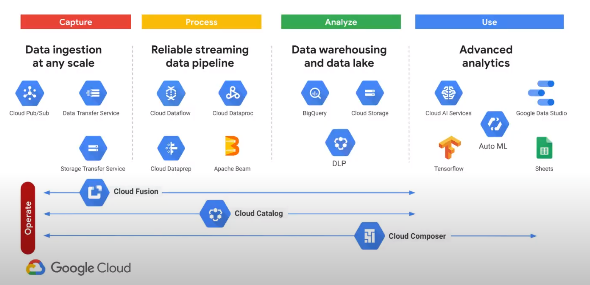
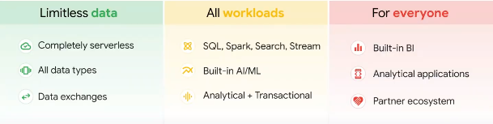
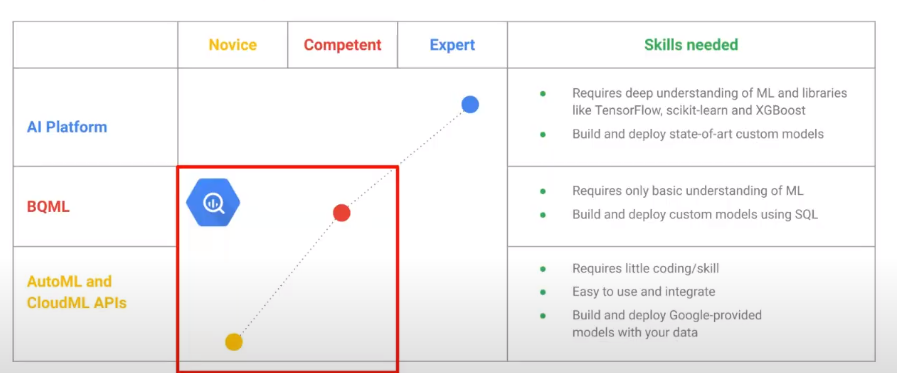
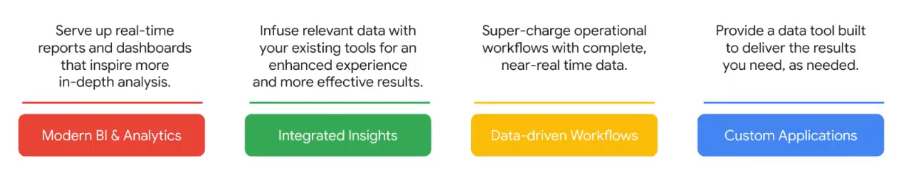

# 5 - ACE Data Analytics

## How ?
- Collects 
- Process 
- Store 
- Analyze data

## Google's Data Cloud 
### Keywords 
- Simplicity 
- Limitless
- Intelligent

### Challenges of data 
- Data is big and multi-format
- Data requires more than SQL
- Data needs to reach everyone and in real-time

### Data Analytics in GCP 

## Example of Google Products in Data Analytics

### BigQuery (collect and store data)
#### 1. Overview 

#### 2. What is BigQuery ?
- Unified platform drom Data to AI : 
    - **Unified experience** : single product UX 
    - **Unified data** : unstructured/structured 
    - **Unified engine** : SQL, Spark,...

#### 3. Features 
- `Single Notebook workspace` for all workloads SQL, Spark, ...
- `Enabling collaboration and governance` across teams & individuals 
- `Centralized source control` and revision history

#### 4. Multimodal data and AI with BigLake 
- `BigLake` : unified data lake and warehouse
- You can store different kinds of data in the BigLake such as pictures, movies
- **Features :**
    - Multimodal data (not only text)
    - Unified governance 
    - Unified data and access control

#### 5. Cross cloud analytics with BigQuery Omni 
- The storage in BigQuery is by region 
- **Cross cloud analytics features :**
    - Provides a unified control plane for streamlined analysis accross clouds 
    - Unified governance across multi-cloud data 

#### 6. Advanced Analytics with BigQuery 
- **BQML** : BigQuery ML 
    - used to build and run ML models : 
        - linear regression 
        - multiclass logistic regression for classification 
        - K-means Clustering (Beta) for segmentation
        - Matrix Factorization (Alpha) for recommendation 
        - Import Tensorflow DNN models (Alpha) for prediction

### Looker (visualize your data also called Business Intelligence)

#### What is Looker ? 
- **API-first and cloud native** for integrating into existing workflows 
- **Semantic modeling layer** for entreprise-wide governance 
- **In-database architecture** for access to real-time data 

#### Features 

> Note : you can also use Gemini with Looker 

#### Looker : based on a semantic layer 
- Semantic layer act as a backbone for analytics and are increasingly tied to AI and ML technologies 
- Semantic layers enable users to obtain accurate insights from complex data sets 

#### Analytics type in Looker 
- **Out-of-the-box** visual, real-time and self-service analytics : 
    - interactive and collaborative dashboard reports 
    - access to variety of data and sources 
    - pre_modelled LookML template with Looker Blocks
    - Securely send governed data with Looker Actions
- **Composable** platform to build fully custom data experiences : 
    - interactive embedding 
    - robust API coverage 
    - monetized data apps 
    - tools for faster application development
