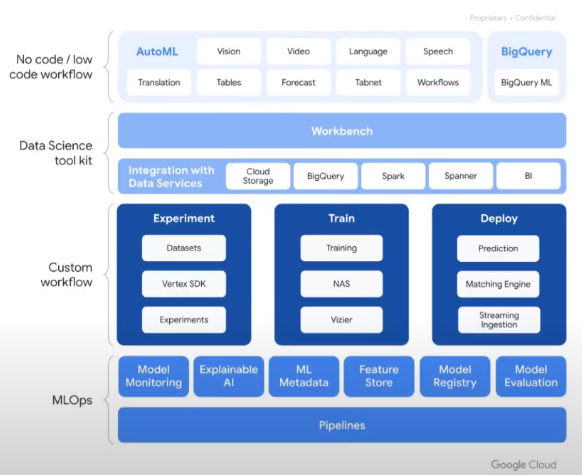

# 6 - Machine Learning / GenAI

## Evolution of AI capabilitiés and tools 
1. **Predictive AI** : 
    - Regression & Classification Forecasting 
    - Sentiment Analysis 
    - Entity Extraction 
    - Object Detection 
2. **Generative AI** 
    - Text, Image & Code Generation 
    - Text & Code Rewriting & Formatting 
    - Summarization 
    - Extractive Q&A
    - Image & Video Description
3. **Multimodal Generative AI**
    - Natural Image Understanding 
    - Video Question Answering 
    - Automatic Speech Recognition & Translation 
    - Spatial Reasoning and Logic 
    - Mathematic Reasoning in Visual Context 

## Introducing AI @ Google - Predicive AI 
Cloud AI has multiple way of consumption : 
- Out of the box : 
    - Pre-trained API & AI Agents (e.g : Cloud Vision API)
- Custom AI (Your data trained with Google's model) with BigQuery ML or AutoML 
- DIY (You create your own model - From scratch): 
    - Vertex AI End-to-End AI with core tools

### Vertex AI for ML 
#### Vertex AI pre-trained model 
- **Vision :**
    - Vision, AutoML Vision, Video Intelligence, AutoML Video Intelligence
- **Language :**
    - Translation, AutoML Translation, Natural Language, AutoML Natural Language
- **Conversation :**
    - Dialogflow, Speech-To-Text, Text-To-Speech, Speaker ID
- **Structured data :**
    - AutoML tables, Fleet Routing API, Vertex AI Forecast, Tabnet, Timeseries insights API 

#### Vertex AI : unified development and deployment platform for data science and machine learning 

### BigQuery ML 
- **What ?** SQL interface to Vertex

#### Process Schema 
Instead of exporting data to Vertex, BigQuery ML simplify the process by training and deploying the model

Example : 

#### Features & capabilities 

#### Insights from unstructured data right inside BigQuery 
- You can also use `unstructured data in BigQuery` such as `images, docs, text` on BigQuery or Cloud Storage even if BigQuery is known for his SQL Query

### AutoML 

#### How (Process) ?
You just need to : 
- define data, % for training, % for evaluation, % for last test
- AutoML will test it with a lot of model and will show you the best model for it with accuracy 
- after that you can use that as an API 

### AutoML VS Vertex AI VS BigQuery ML 

## Vertex AI Platform - Generative AI 
### Purpose built-in infrastructure for Generative AI 
- Provide a wide variety of hardware options 
- Speed up training & inference time with high-performance computing 
    - modern GPUs made by NVIDIA 
    - TPUs by Google 
- Improve price performance & cost 
- Scale AI models exponentially 
- Leverage our fully managed AI platform optimized for efficiency 
- Build with an open source software ecosystem

### Vertex AI - GenAI Models 
#### Vertex AI Model Garden 
- Foundational Catalog Model made by Google and partners

- **Gemini :**
    - state-of-the-art multimodal capabilities 
    - highly optimized while preserving choice 
    - built with responsibility and safety at the core
    - Gemini Pro is `available on Google Data Studio and Vertex AI Studio`
    1. Gemini 1.5 Pro 
        - mid-size multimodal model with breakthrough long-context understanding 
        - **News** : expanded content window (up to 1 million tokens) for complex reasoning accross vast amounts of information 
- **Imagen 2.0 :**
    - Text-to-image model
3. **Gemma at Glance :**
    - open source model, on-edge (compact)
    - is a family lightweight, state-of-the-art open models built from the same research and technology used to create Gemini 

#### Vertex AI Model Builder

- Temperature of model : Model creativity 
- Output token : size of gemini output 
- Safety settings 

##### MLOps 
- **Purpose :** Create a pipeline to train model automatically

##### What? 
- It means : 
    - Prompt | Tune | Serve | Distill | Eval | Notebook | Training | Feature Store | Monitoring

#### Vertex AI Agent Builder

- Ground : limit 
- Search engine scraping in your own website

### Tuning in Vertex AI 
- Tuning means improving the existing model for example by using your own data 

#### Types : 
- Prompt design 
- Supervised tuning 
- Distillation 
- RLHF (Reinforcement learning from human feedback) 
    - it means that you tell if the output of the prompt is OK or not 
- Full fine tuning 

#### Extensions in Vertex AI : connect LLMs to the world 
- Access live data 
- Complete transactions
- Access private data 

#### Generative AI workflow 

> **Citation check :** avoid plagiarism in the output 

## Google Cloud with Gemini 
- You can use `Code Assist`(build with Gemini) to naviage in the GCP console