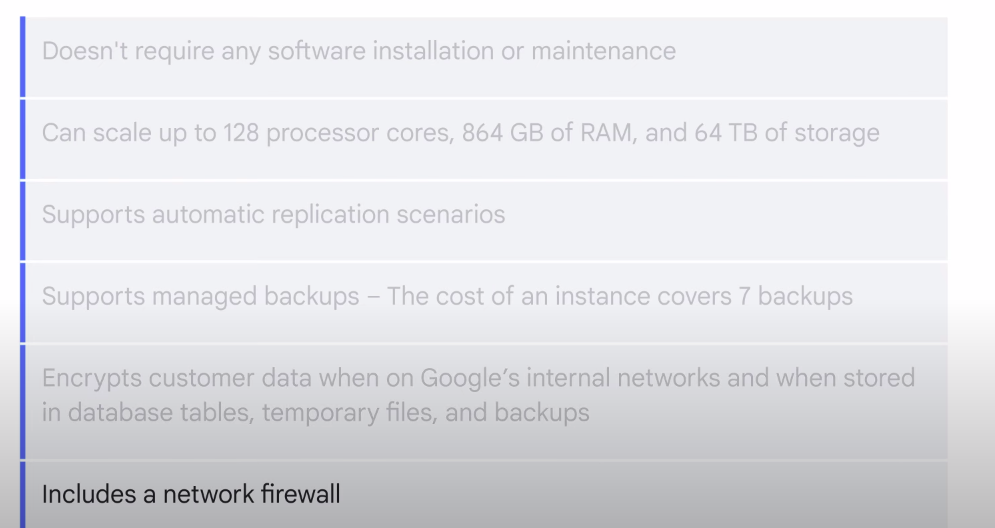

# Cloud SQL

## Features 
- offers fully managed relational databases, including MySQL, PostgreSQL, and SQL Server as a service
- designed to hand off mundane, but necessary and often time-consuming such as : 
    - Applying patch/updates
    - Managing backup 
    - Configuring replications

## Benefits

