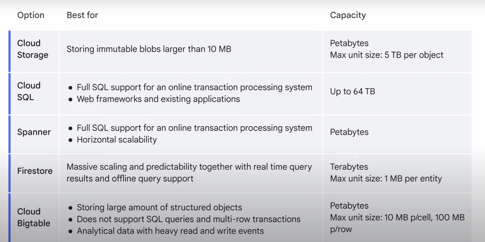

# Comparison between those kind of storage 

## Reason to store data in BigQuery 
The usual reason to store data in BigQuery is so you can use its big data analysis and interactive querying capabilities, but it’s not purely a data storage product.