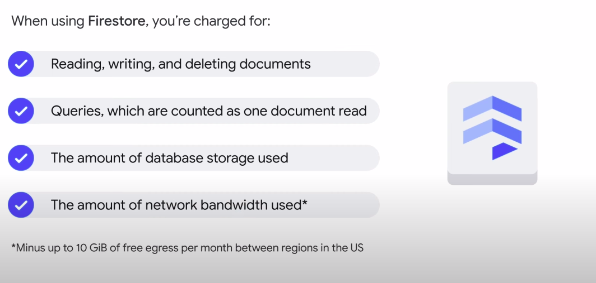

# Firestore 

## What is Firestore ? 
Firestore is a flexible, horizontally scalable, NoSQL cloud database for mobile, web, and server development.

## Firestore data organization 
With Firestore, data is stored in documents and then organized into collections.
Documents can contain complex nested objects in addition to subcollections. 

## Why do we need Firestore ? 
Firestore’s NoSQL queries can then be used to:
- retrieve individual, specific documents
- retrieve all the documents in a collection that match your query parameters
- can include multiple, chained filters and combine filtering and sorting options
- They're also indexed by default, so query performance is proportional to the size of the result set, not the dataset
- use data synchronization to update data on any connected device. It caches data that an app is actively using, so the app can write, read, listen to, and query data even if the device is offline.

## Firestore quota
Firestore has free quota per day : 
- 50,000 document reads
- 20,000 document writes
- 20,000 document deletes
- 1 GB of stored data