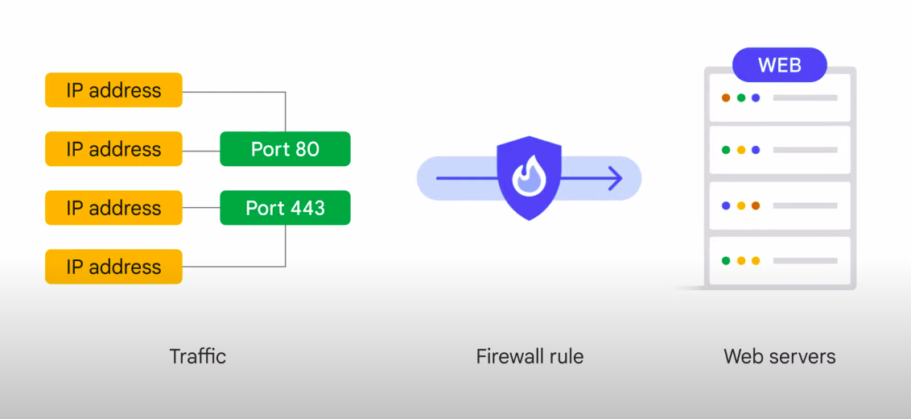

# Compute Engine (an IaaS Google Cloud Resources)

## Features 
- Can run and create instance of a virtual machine with Google Cloud Infrastructure 
- No upfront investments
- Thousand of virtual machines can run on a system that's designed to be fast and to offer consistent performance
- Each VM contains the power of a full fledged operating system (OS complet)
- Can be configured much like a physical server by : 
    - Specifying the amount of CPU power and memory needed 
    - Specifying the amount of type of storage needed and the operating system

## VM specification
- Can be created using `the Google Cloud Console, the Google Cloud CLI or the Compute Engine API`
- Can run Linux and Windows Server images provided by Google or any customized version of image
- Can build and run images of other operating systems and flexibly reconfigure VMs

## Get started with Google Cloud MarketPlace
Access to the `Cloud MarketPlace` : which offers solutions from Google and third party vendors
    - Most software packages are available at no additional charge beyond the normal fees
    - Some Cloud MarketPlace charge usage fees, but they all show estimates of their monthly charges before they are launch particularly those are published by third parties with a commercial license

## Compute Engine Billing 
- Bills by the second with 1 minute minimum 
- Offers `substained use discount` automatically to the VM the longer they run (to the VM that run more than 25%, compute Engine apply discount per minutes)
- Offers `comitted use discount`: it means that for stable and predictable workloads, a specific amound of vCPUs can be purchased for up to a 57% discount off of normal prices in return for committing to a usage term of one year or three year 
- `Premptible and spot VMs` : it's like a batch job analyzing a large dataset
    - **Difference between `Premptible and spot VMs` to an ordinary `Compute Engine VMs`**
        - Compute Engine has permission to terminate his job when the resources are needed elsewhere. Although savings are possible with `Premptible and spot VMs` you'll need to ensure that your job can be stop and start
    - **Difference between `Premptible and spot VMs`**
        - `Premptible VMs` : less features, runtime up to 24h, same pricing
        - `Spot VMs`: more features, no maximum runtime, same pricing

- `Pay for what you need`: when you use `Custom Virtual machine types`

## Scaling Virtual Machines
- With Compute Engine, you can in fact configure very large VMs, which are great for workload
- Specification for currently VMs can be found at : `https://cloud.google.com/compute/docs/machine-resource?hl=fr`

### How to choose machine properties ? 
- By using a set of predifines machine types 
- By Creating your own custom machine types

### Autoscaling 
- `Autoscaling` is a feature of Compute Engine where VMs can be added to or substracted from an application based on load metrics (load balancing)

### Maximum number of CPUs of a VM
- Tied to its machine family
- Constrained by the user's quota which is zone-dependent

## Important VPC Compatibilities features 
- VPC has `routing tables`
    - Routing tables are built-in
    - No routes provisioning or managing
    - Forward traffic of one instance to another within the same network
    - No external IP Adress required
- VPC has a `firewall`
    - No routes provisioning or managing
    - Restrict access to instances
    - Rules can be defined through `network tag` on `Compute Engine instances`

    

- **VPC Peering** : 
    - Needed when VPCs need to communicate with each other
        - Relation can be established to exchange traffic
    - To configure the communication, you can use `Shared VPC` (manage policies, restrict rules)

## Cloud Load Balancing

- **Role** : to distribute user traffic across multiple instances of an application (a lot of VMs). By spreading the load, load balancing reduces the risk that applications experience performance issues.

### Features
- Fully distributed, software-defined, managed service (it means because the load balancers don’t run in VMs that you have to manage, you don’t have to worry about scaling or managing them) for all your traffic
- You can put Cloud Load Balancing in front of all of your traffic: HTTP or HTTPS, other TCP and SSL traffic, and UDP traffic too
- Provides cross-region load balancing, including automatic multi-region failover, which gently moves traffic in fractions if backends become unhealthy.
- No so-called “pre-warming” is required. Cloud Load Balancing always anticipate

### Load Balancing Options
-  `Global HTTP(S) load balancing`: If you need cross-regional load balancing for a web application
- `Global SSL Proxy load balancer` : Secure Sockets Layer traffic that is not HTTP
- `TCP Proxy load balancer` : If it’s other TCP traffic that doesn’t use SSL
- `Regional External Passthrough Network load balance` : If you want to load balance UDP traffic, or traffic on any port number, you can still load balance across a Google Cloud region. On top of that, you can also deploy Regional External Application load balancer and Proxy Network load balancer.
- `Regional Internal load balancer` : if you want to load balance traffic inside your project, say, between the presentation layer and the business layer of your application. It supports Proxy Network load balancer, Passthrough Network load balancer, and Application load balancer. It accepts traffic on a Google Cloud internal IP address and load balances it across Compute Engine VMs. 
- `Google Cloud Cross-region Internal load balancer` : a Layer 7 load balancer that enables you to load balance
traffic to backend services that are globally distributed, including traffic management that ensures traffic is directed to the closest backend.

## Cloud DNS (Domain Name System) and Cloud CDN (content delivery network)

### What is a DNS ?
DNS is what translates internet hostnames to addresses, and as you might imagine, Google has a highly developed DNS infrastructure. It makes 8.8.8.8 available so that everyone can take advantage of it.

### What about the internet hostnames and addresses of applications built in Google Cloud?

Google Cloud offers `Cloud DNS` to help the world find them.

#### What is Cloud DNS ? 
- It’s a managed DNS service that runs on the same infrastructure as Google.
- It has low latency and high availability, and it’s a cost-effective way to make your applications and services available to your users.
- The DNS information you publish is served from redundant locations around the world.
- Cloud DNS is also programmable. You can publish and manage millions of DNS zones and records using the Cloud Console, the command-line interface, or the API.
- Google also has a global system of edge caches. Edge caching refers to the use of caching servers to store content closer to end users. You can use this system to accelerate content delivery in your application by using **Cloud CDN - Content Delivery Network**.

#### What is Cloud CDN ? 
This means your customers will experience lower network latency, the origins of your content will experience reduced load, and you can even save money.
After HTTP(S) Load Balancing is set up, Cloud CDN can be enabled with a single checkbox.

- Cloud CDN Cache Mode : Using cache modes, you can control the factors that determine whether or not Cloud CDN caches your content by using cache modes.Cloud CDN offers three cache modes, which define how responses are cached, whether or not Cloud CDN respects cache directives sent by the origin, and how cache TTLs are applied. The available cache modes are :

    - **USE_ORIGIN_HEADERS** : requires origin responses to set valid cache directives and valid caching headers.
    - **CACHE_ALL_STATIC** : automatically caches static content that doesn't have the no-store, private, or no-cache directive.
    - **FORCE_CACHE_ALL** :  unconditionally caches responses, overriding any cache directives set by the origin.
