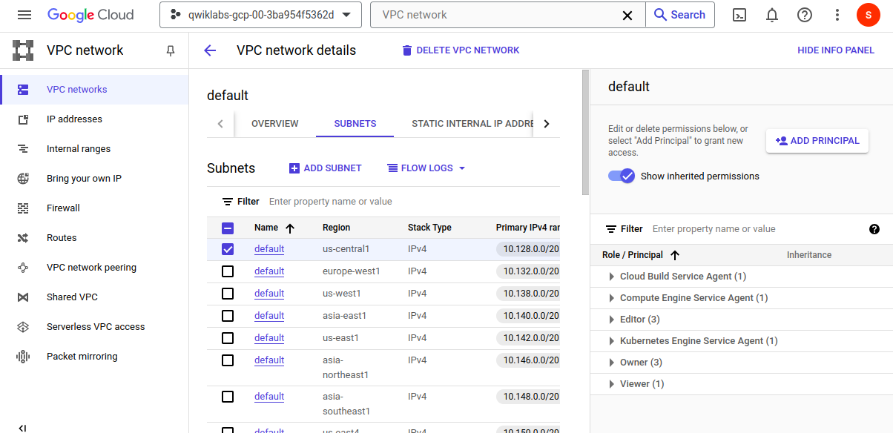
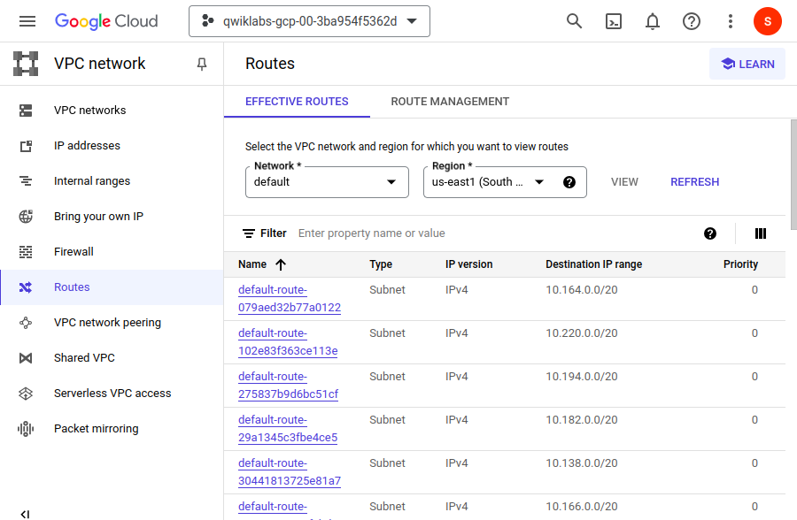
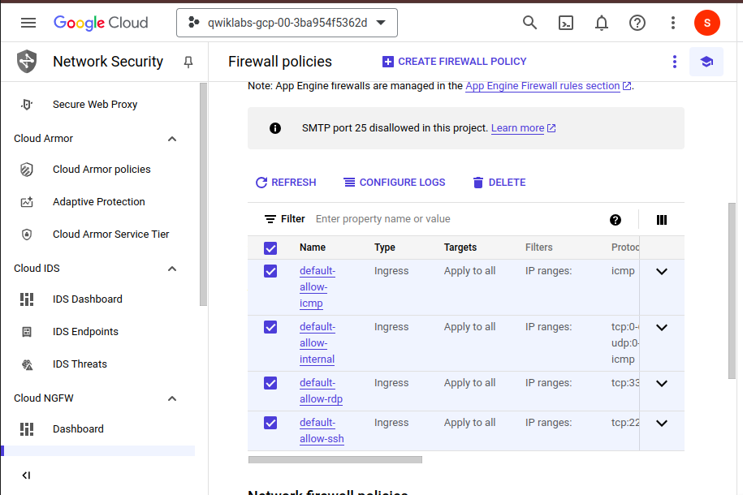
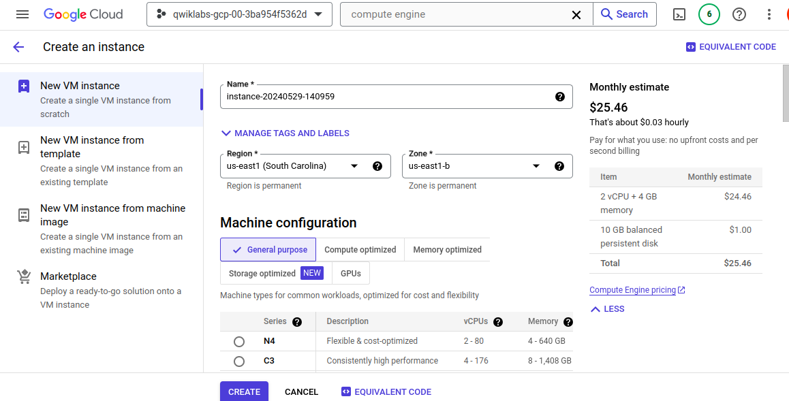
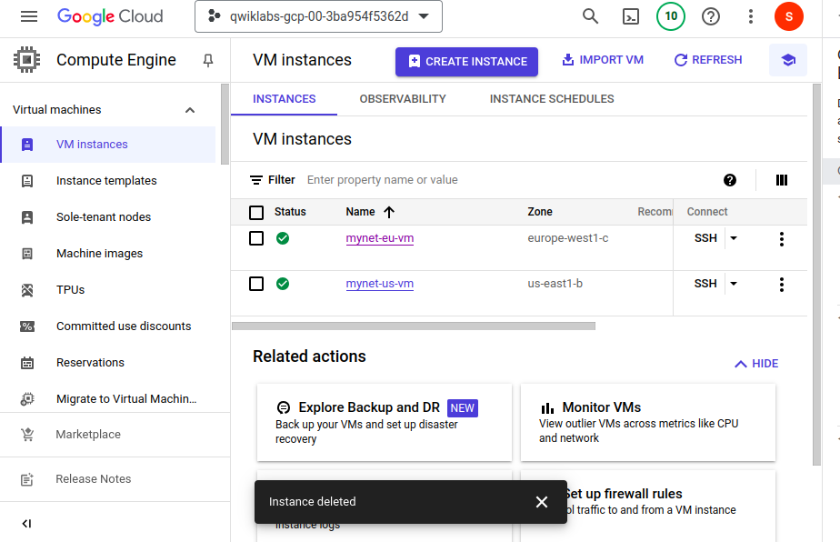

# Getting Started with VPC Networking and Google Compute Engine

Link : https://www.cloudskillsboost.google/paths/11/course_templates/60/labs/465780

**Goal :** 
- Explore the default VPC network
- Create an auto mode network with firewall rules
- Create VM instances using Compute Engine
- Explore the connectivity for VM instances

## Access to the VPC network and subnet
The default network has a subnet in each Google Cloud region.

- In the Cloud Console, on the Navigation menu (Navigation menu icon), click VPC network > VPC networks.

- Click default.

- Click Subnets.

> Notice the default network with its subnets. Each subnet is associated with a Google Cloud region and a private RFC 1918 CIDR block for its internal IP addresses range and a gateway.

## Access to the Routes
Routes tell VM instances and the VPC network how to send traffic from an instance to a destination, either inside the network or outside Google Cloud. Each VPC network comes with some default routes to route traffic among its subnets and send traffic from eligible instances to the internet.

- In the left pane, click Routes.

- In Effective Routes click Network, and then select default.

- Click Region and select the Lab Region assigned to you by Qwiklabs.

- Click View.

## Delete the Firewall rules
Each VPC network implements a distributed virtual firewall that you can configure. Firewall rules allow you to control which packets are allowed to travel to which destinations. Every VPC network has two implied firewall rules that block all incoming connections and allow all outgoing connections.

In the left pane, click Firewall.
Notice that there are 4 Ingress firewall rules for the default network:
default-allow-icmp (this protocol allow you to ping other adress IP in the internet pour l'external adress)
default-allow-rdp
default-allow-ssh (connexion CLI)
default-allow-internal

> Note: These firewall rules allow ICMP, RDP, and SSH ingress traffic from anywhere (0.0.0.0/0) and all TCP, UDP, and ICMP traffic within the network (10.128.0.0/9). The Targets, Filters, Protocols/ports, and Action columns explain these rules.

## Delete the default network 
- Select all of the default network firewall rules.
- Click Delete.
- Click Delete to confirm the deletion of the firewall rules.

## Create a VPC Network and VM instances
Create an auto mode VPC network with Firewall rules
Replicate the default network by creating an auto mode network.

- On the Navigation menu (Navigation menu icon), click VPC network > VPC networks.
- Click Create VPC network. For Name, type mynetwork.
- For Subnet creation mode, click Automatic.
Auto mode networks create subnets in each region automatically.
- For Firewall, select all available rules.

    These are the same standard firewall rules that the default network had.
    The deny-all-ingress and allow-all-egress rules are also displayed, but you cannot check or uncheck them because they are implied. These two rules have a lower Priority (higher integers indicate lower priorities) so that the allow ICMP (internet control message Protocol), custom, RDP (remote desktop protocol) and SSH rules are considered first.

- Click Create.
- When the new network is ready, notice that a subnet was created for each region.
- Explore the IP address range for the subnets in Region 1 and Region 2.

## Create VM instance in a region 
- Create a VM instance in the Region region. Selecting a region and zone determines the subnet and assigns the internal IP address from the subnet's IP address range.

- On the Navigation menu (Navigation menu icon), click Compute Engine > VM instances.

- Click Create instance.

- Specify the following, and leave the remaining settings as their defaults:

## Create an instance with compute engine 

