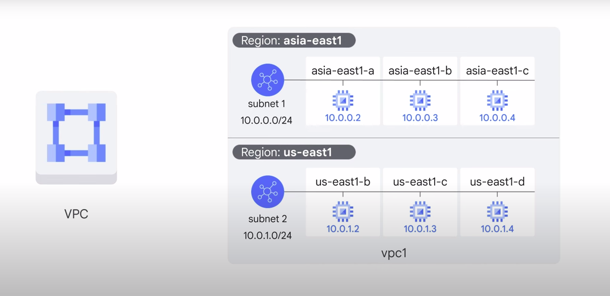

# Virtual Private Cloud Networking

**Goal of the course** : focus on how `Compute Engine` works with a focus on Virtual Networking.

## What is a Virtual Private Cloud (VPC) ?

- Secure, indivual, private cloud-computing model hosted within a public cloud like Google Cloud

## Features ?

- Customers can run codes, store data, host websites and do anything else they could do in a ordinary private cloud
- Hosted remotely by a public cloud provider
- Combine the scalabity and convenience of a public cloud with the data isolation of private cloud computing

## What about VPC network features ? 
- Connect Google Cloud resources to each other and the internet. This includes : 
    - Segmenting networks
    - Using firewall to restrict access to instances
    - Creating static route to forward traffic to specific destinations
- Google VPC network are global and can have subnets in any Google Cloud region worldwide. `So, resources can be on a different zone on the same subnet`.
- The size of the subnet can be increased by increasing the range of IP adresses allocated to it

## Connecting Network to Google Cloud VPC 

There are several effective ways to accomplish this :

1. **Cloud VPN** :  to create a “tunnel” connection.
    - To make the connection dynamic, a Google Cloud feature called Cloud Router can be used. But using the internet to connect networks isn't always the best option for everyone, either because of security concerns or because of bandwidth reliability.

2. **Direct Peering**
    - Peering means putting a router in the same public data center as a Google `point of presence` and using it to exchange traffic between networks.
    - Customers who aren’t already in a point of presence can work with a partner in the `Carrier Peering program` to get connected.

3. **Carrier Peering**
    - Carrier peering gives you direct access from your on-premises network through a service provider's network to Google Workspace and to Google Cloud products that can be exposed through one or more public IP addresses.

4. **Dedicated Interconnect** : you can use it if getting the highest uptimes for interconnection is important
    - This option allows for one or more direct, private connections to Google.
    - If these connections have topologies that meet Google’s specifications, they can be covered by an SLA(service-level agreement) of up to 99.99%.
    - These connections can be backed up by a VPN for even greater reliability

5. **Partner Interconnect**
    - Provides connectivity between an on-premises network and a VPC network through a supported service provider
    - Useful if a data center is in a physical location that can't reach a Dedicated Interconnect colocation facility, or if the data needs don’t warrant an entire 10 GigaBytes per second connection. 
    - Depending on availability needs, Partner Interconnect can be configured to support mission-critical services or applications that can tolerate some downtime.

6. **Cross-Cloud Interconnect**
    - Helps you establish high-bandwidth dedicated connectivity between Google Cloud and another cloud service provider.
    - Cross-Cloud Interconnect supports your adoption of an integrated multicloud strategy.

## VPC Object 
VPC provides IP addresses for internal and external use along with granular IP address range selections. As for virtual machines, in this module, we will focus on configuring VM instances from a networking perspective.

Those are VPC Object : 

1. **Projects** : are going to encompass every single service that you use including networks
2. **Networks** : come in three different flavors; ***default, auto mode, and custom mode***
3. **Subnetworks** :  allow you to divide or segregate your environment
4. **Regions** : in zones represents Google's datacenters and they provide continuous Data Protection and high availability
5. **Zones**

### Types of Network 
1. **Default** 
    - Every project is provided with a default VPC network
    - One subnet per region 
    - Default firewall rules
2. **Auto** 
    - One subnet from each region is automatically created within it
    - The default network is actually an auto mode network : These automatically created subnets use a set of predefined IP ranges with a /20 mask that can be expanded to /16. All of these subnets fit within the 10.128.0.0/9 CIDR block.
3. **Custom**
    - Does not automatically create subnets
    - Full control of IP ranges 
    - Regional IP allocation 
    - Expandable to IP adress you specify 

### Network isolate systems
