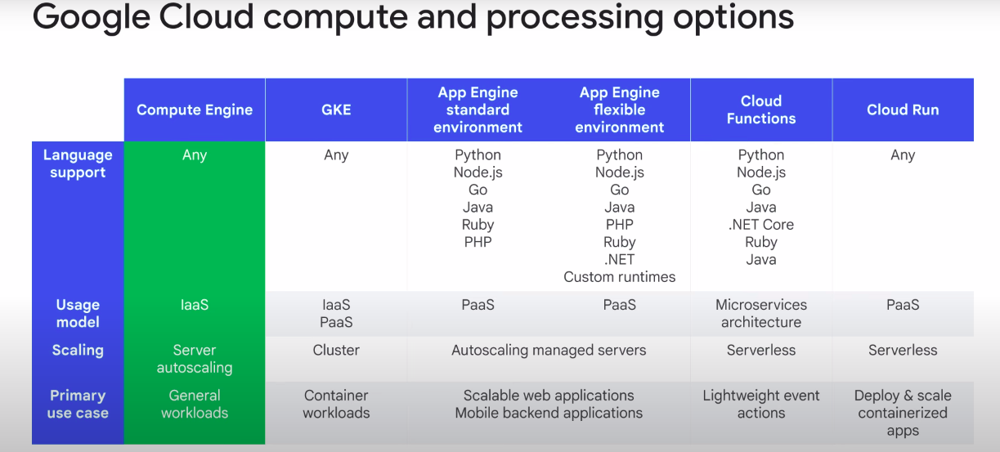

# Compute Engine

### Introduction
- Overview of various Google Cloud compute options.
- Focus on traditional virtual machine instances.



### Compute Engine
- **Flexibility:** Run any language; manage as you wish.
- **Infrastructure as a Service (IaaS):** VM and OS management, autoscaling configuration.
- **Primary Use Case:** Generic workloads, especially enterprise applications designed for server infrastructure.
- **Portability:** Easy to run in the cloud compared to containerized services like Google Kubernetes Engine.

### What is Compute Engine?
- **Core Concept:** Physical servers in Google Cloud with various configurations.
- **Machine Types:** Predefined and custom options for memory and CPU.
- **Disk Options:** Persistent disks, SSDs, local SSDs, Cloud Storage.
- **Networking:** Configure interfaces; run Linux and Windows machines.
- **Features:** Machine rightsizing, startup/shutdown scripts, metadata, availability policies, OS patch management, pricing, and usage discounts.

### Hardware Limitations and TPUs
- **Challenges:** CPUs and GPUs can't scale to meet machine learning demands.
- **TPUs (Tensor Processing Unit):** Custom-developed ASICs by Google for machine learning acceleration.
  - **Advantages:** Higher efficiency, faster performance, energy efficiency.
  - **Integration:** Available across Google products and recommended for long-duration, large-batch training models.

### Compute Options
- **Machine Types:** Several types with customization options.
- **CPU and Network Throughput:** Network scales at 2 Gbps per CPU core; up to 10 Gbps for 2 or 4 CPUs; maximum of 200 Gbps for 176 vCPU in C3 machine series.

- **vCPU Implementation:** Each vCPU is a hardware hyper-thread on available CPU platforms.

### Disk Choices
- **Types:** Standard, SSD, local SSD.
- **Performance vs. Cost:** SSDs offer higher IOPS per dollar; standard disks offer more capacity per dollar.
- **Local SSDs:** Higher throughput, lower latency, but data persists only until instance is stopped or deleted.
- **Capacity:** Standard and SSD disks up to 257 TB per instance; performance scales with GB allocated.

### Networking
- **Features:** Regional HTTPS load balancing, network load balancing, no pre-warming needed.
- **Load Balancers:** Traffic engineering rules applied by VPC, not hardware devices.

### Further Learning
- Detailed exploration of autoscaling, machine types, CPU platforms, and load balancing in future modules.

### Command line for custom machines (SSH)

- To see information about unused and used memory and swap space on your custom VM, run the following command

```bash
free
```

- To check the details of the RAM you have installed in your VM

```bash
sudo dmidecode -t 17
```

- To verify the number of processor : 

```bash
nproc
```

- To see the details about your CPU in your VM :

```bash
lscpu
```