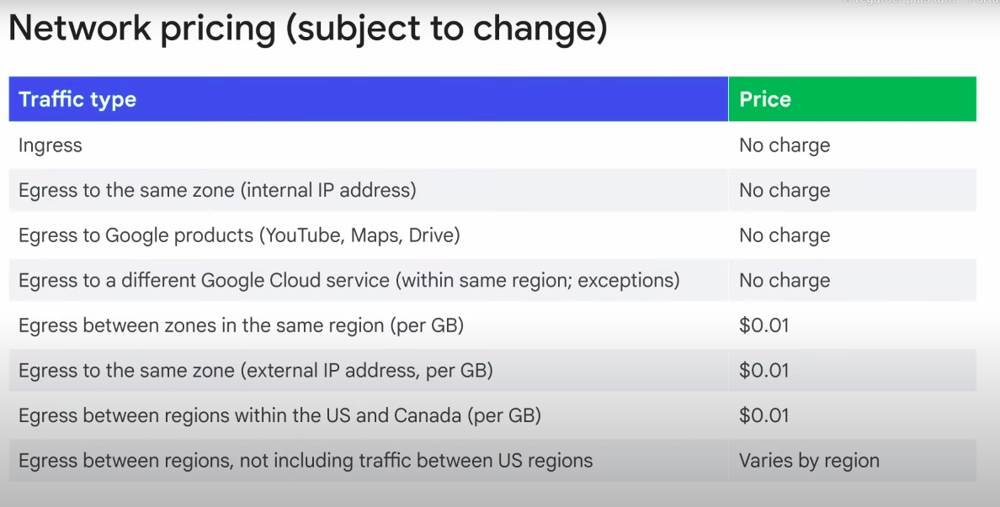
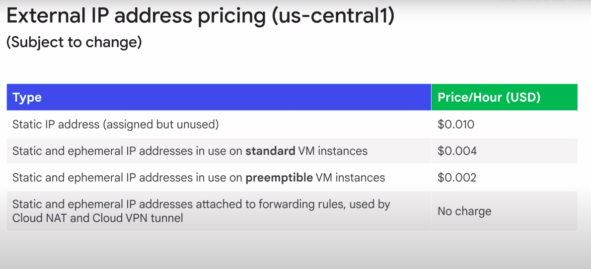

# Network Pricing 

## Pricing comment : 
- **Ingress** : not charged, unless there is a resource, such as a load balancer that is processing egress traffic 
- **Egress traffic to the same zone** : is not charged as long as that egress is through the internal IP address of an instance

## External IP adress pricing 
- **Assigned but not used :** not assigned to a resource, such as a VM
