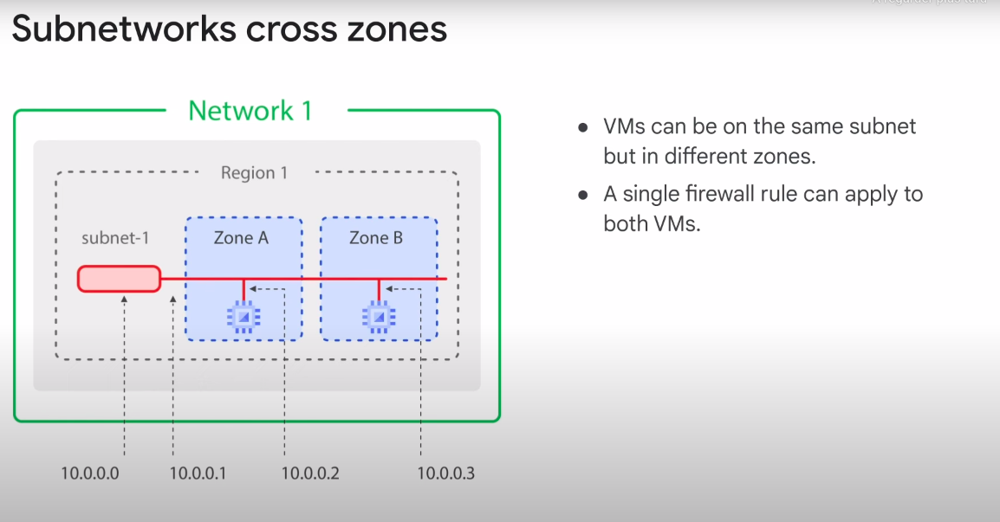
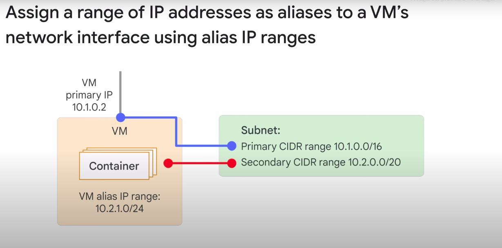

# Projects, networks and subnetworks

## Projects
- Key organizer of infrastructure resources in Google Cloud
- A project associates objects and services with billing
- The default quota for each project is `15 networks`, but you can simply request additional quota using the Google Cloud console.

## Networks 
- The network of projects `do not have IP ranges` but is simply a construct of all of the individual IP addresses and services within that network.
- Google Cloud’s networks are global, spanning all available regions across the world. So, you can have one network that literally exists anywhere in the world—Asia, Europe, Americas—all simultaneously.

## Subnetwork zones 

Also : 
- Speaking of IP addresses of a subnet, Google Cloud VPCs let you increase the IP address space of any subnets without any workload shutdown or downtime.
    - This gives you flexibility and growth options to meet your needs, but there are some things to : 
        - The new subnet must not overlap with other subnets in the same VPC network in any region.
        - Each IP range for all subnets in a VPC network must be a unique valid CIDR (routage inter-domaines sans classe) block.
        -  The new subnet IP address ranges are regional internal IP addresses and have to fall within valid IP ranges.
        - The new network range must be larger than the original, which means the prefix length value must be a smaller number
        - avoid creating large subnets

## How to expand a custom subnet within GCP ?

### Understanding Subnetting

IP addresses are divided into subnets using CIDR notation, which indicates how many bits are used for the network portion of the address. The remaining bits are used for host addresses within that subnet.

#### /29 Subnet

- **/29** means 29 bits are for the network and 3 bits are for hosts. (32 bits - 29 bits)
- Total addresses: \(2^3 = 8\).
- But of those, four are reserved by GCP, which leaves you with another four for your VM instances.
- Usable addresses: \(8 - 4 = 4\).
- Typically, one address is used for the gateway, leaving 5 addresses, but in practice, you often get 4 usable addresses for instances.

#### /23 Subnet

- **/23** means 23 bits are for the network and 9 bits are for hosts.
- Total addresses: \(2^9 = 512\).
- But of those, four are reserved by GCP, which leaves you with another four for your VM instances.
- Usable addresses: \(512 - 4 = 508\).
- Typically, one address is used for the gateway, leaving around 509 usable addresses for instances.

### Summary

- **/29** subnet: Usually provides 4 usable addresses for instances.
- **/23** subnet: Provides around 500 usable addresses for instances.

The difference comes from the number of bits allocated for hosts in each subnet. More bits for hosts means more available IP addresses.

## IP Adresses 

### Internal IP Adress
- assigned via DHCP internally
- Every VM that starts up and any service that depends on virtual machines gets an internal IP address
- DHCP lease is renewed every 24 hours
- VM name + IP adress is registered with network-scoped DNS (The DNS is scoped to the network, so it can translate web URLs and VM names of hosts in the same network, but it can't translate host names from VMs in a different network)
- Can be assigned from pool making it ephemeral or from a reserved external IP address, making it static
- Internal IP Adress don't change but If you delete and recreate an instance, the internal IP address can change

#### DNS Resolution

Google Cloud has 2 types of Internal addresses : 
- Zonal (recommended by Google because it offers higher reliability guarantees by isolating failures in the DNS registration to individual zones)
- Global (project wide) 

Each instance has a `hostname` that can be resolved to an internal IP address : 
- This hostname is the same as the instance name
- There is also an internal fully qualified domain name, or FQDN (Fully qualified domain name which refers to a unique identification guaranteed by the fact that all domain levels are indicated), for an instance that uses the format `my-server.us-central1-a.c.guestbook-151617.internal`

Name resolution is handled by `internal DNS resolver` : 
- Provided as part of Compute Engine (169.254.169.254)
- Configured for use on instance via DHCP
- Provides answer for internal and external addresses

### External IP Adress
- Optional
- You can use your own publicly routable IP address prefixes as Google Cloud external IP addresses and advertise them on the Internet
- In order to be eligible, you must own and bring a /24 block or larger
- IP Adress change when you refresh your VM
- mapped to the VM's internal address transparently by VPC

#### DNS Resolution

Instances with external IP addresses can allow connections from hosts outside of the project : 
- Users can do so directly using the external IP address.
- Public DNS records pointing to instances are not published automatically; however, admins can publish these using existing DNS servers

- Domain name servers can be hosted on Google Cloud, using Cloud DNS

### Cloud DNS

Cloud DNS is a scalable, reliable, and managed authoritative Domain Name System, or DNS, service running on the same infrastructure as Google.

#### Features 
- translate domain name into IP addresses 
- low latency 
- high availability (with a 100% SLA or Service Level Agreement)
- lets you create and update millions of DNS records without the burden of managing your own DNS servers and software

### Alias IP Ranges
Alias IP Ranges let you assign a range of internal IP addresses as an alias to a virtual machine's network interface. This is useful if you have `multiple services running on a VM`, and you want to assign a different IP address to each service.

In essence, you can configure multiple IP addresses, representing containers or applications hosted in a VM, without having to define a separate network interface : 
- You just draw the alias IP range from the local subnet's primary or secondary CIDR (`Classless Inter-Domain Routing` which enables routers to organize IP addresses more efficiently into multiple subnets) ranges.

This diagram provides a basic illustration of primary and secondary CIDR ranges and VM alias IP ranges :

### IP Addresses and default domain 
Click on this [link](./ip_addresses.pdf) to see the documentation about this section.

### Demo with Compute Engine 
1. When you create on Create a new instance of VM : 
- click on "Management" section 
- click on "Networking" tab
- you can see the internal and external IP Adress Field
- Create your VM 

2. When you try to shutdown your VM 
- reload it 
- try to restart it 
- you can see that Internal IP Adress don't change but external IP Adress Change

