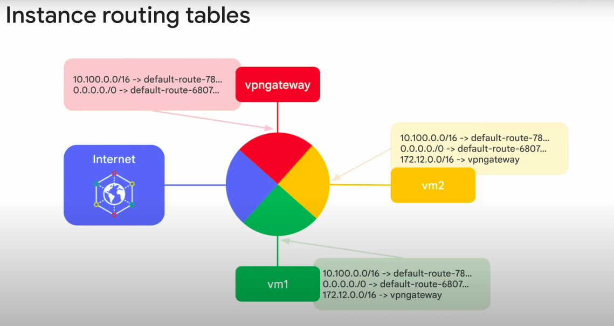
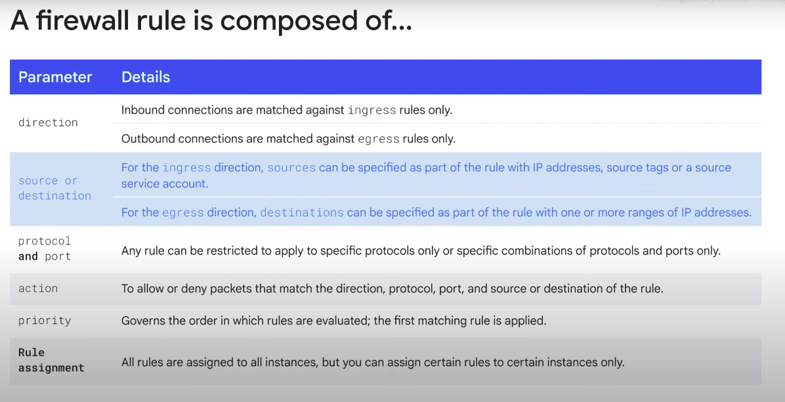
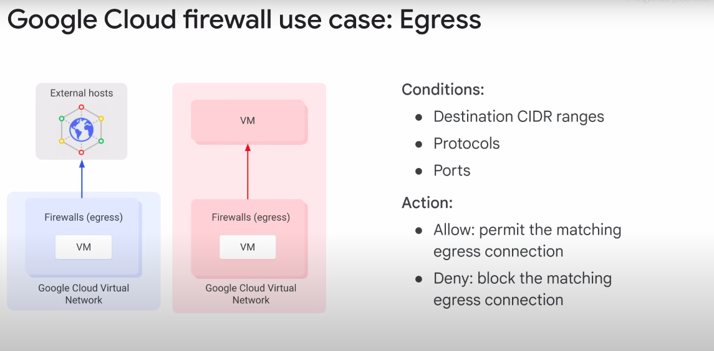
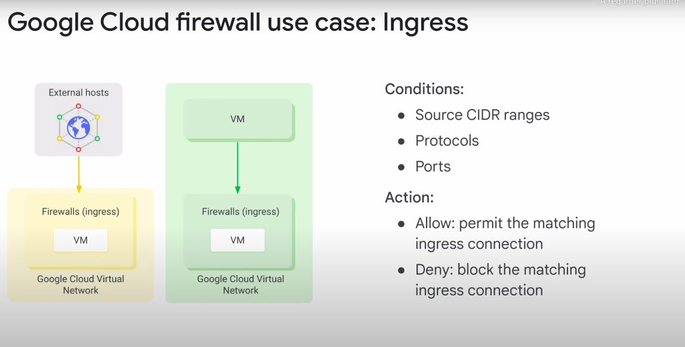

# Routes and firewall rules

## Routes 
A route is a mapping of an IP range to a destination.

Every network has : 
- routes that let instances in a network send traffic directly to each other, even across subnets
- a default route that directs packets to destinations that are outside the network

Just creating a route does not ensure that your packet will be received by the specified next top. 

`Firewall rules` must also allow the packet.

- Compute Engine then uses the Routes collection to create individual read-only routing tables for each instance.

### Routes map traffic to Destination network
- Apply to traffic egressing a VM
- Forward traffic to the most specific route 
- Created when a subnet is created 
- Enable VM on same network to communicate
- Destination is in CIDR notation
- Traffic is delivered only if it matches with the firewall rules

### Example of a massively scalable virtual router at the core of each network

## Firewall rules 
The default network has pre-configured firewall rules that allow all instances in the network to talk with each other.

### Firewall rules to protect your VM instances from unapproved connection 
- VPC network functions as a distributed firewall
- Firewall rules are applied to the network as a whole
- Connections are allowed or denied at the instance level
- GCP firewall rules are stateful (it means if a connection is allowed between a source and a target or a target at a destination, all subsequent traffic in either direction will be allowed)
- Implied "Deny all" ingress rule and an implied "Allow all" egress rule for the network

### Firewall rules components : 

### Google Cloud use case 
#### Google Cloud use case : Egress 
Egress deny rules prevent instances from initiating connections that match non-permitted port, protocol, and IP range combinations.
For egress firewall rules, destinations to which a rule applies may be specified using IP CIDR ranges.

#### Google Cloud use case : Ingress
Ingress allow rules allow specific protocol, ports, and IP ranges to connect in.
The firewall prevents instances from receiving connections on non-permitted ports and protocols.

