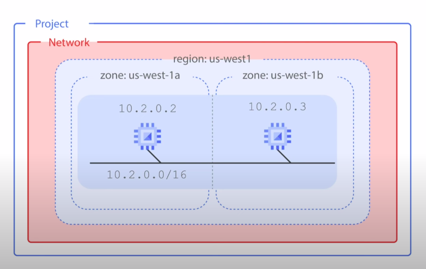

# Common Network Design

## Availability
If your application needs increased availability, you can `place two virtual machines into multiple zones`, but `within the same subnet` work as shown on this slide.

Using a single sub-network allows you to to create a file a rule against the sub-network, in this case, 10.2.0.0/16.

Therefore, by allocating VMs on a single subnet to separate zones, you get improved availability without additional security complexity. A regional managed instance group contains instances from multiple zones across the same region, which provides increased availability.

## Globalization

`Putting resources in different regions` as shown on this slide `provides an even higher degree of failure independence`. This allows you to design robust systems with resources spread across different failure domains.

When using a global load balancer like the HTTP load balancer, you can route traffic to the region that is closest to the user.

This can result in `better latency for users and lower network traffic costs` for your project.

## General security best practice
- Only assigning internal IP addresses to your VM instances whenever possible

## Cloud NAT 

### What is Cloud NAT ? 
Cloud NAT is Google's managed network address translation service.

### What does Cloud NAT do ?
It lets you provision your application instances without public IP addresses, while also allowing them to access the internet in a controlled and efficient manner.

This means your private instances `can access the internet for updates, patching, configuration management, and more`.

Cloud NAT enables two private instances to access an update server on the Internet, which is `referred to as outbound NAT`. However, Cloud NAT `does not Implement inbound NAT`.

## Private Google Access to Google APIs and services
Similarly, you should enable private Google access to allow VM instances that only have internal IP addresses to reach the external IP addresses of Google APIs and services.

For example, if your private VM instance needs to access a cloud storage bucket, you need to enable private Google access.

You enable private Google access on a subnet by subnet basis.

